# File Finder SR3

A specialized document repository for managing and searching bank e-statements converted into text formats (CSV/Plain Text). Built with React + Supabase on Lovable Cloud.

## Project Summary

File Finder SR3 solves the problem of searching across multiple months/years of bank statements by providing:

- **Centralized Document Index** — Upload and organize text files extracted from bank PDFs
- **Full-Text Search** — Search across file names and file content instantly
- **Role-Based Access Control** — Admin approval workflow with granular permissions (read, upload, rejected)
- **Activity Auditing** — Tracks file downloads and user actions
- **Google SSO** — Single sign-on via Google OAuth

## Architecture

```mermaid
graph TB
    subgraph Frontend["Frontend (React + Vite)"]
        UI[UI Components]
        Auth[useAuth Hook]
        Perm[usePermissions Hook]
        Upload[FileUploadModal]
        Viewer[FileViewerModal]
    end

    subgraph SupabaseAuth["Auth (Supabase Auth)"]
        OAuth[Google OAuth SSO]
    end

    subgraph Database["Database (PostgreSQL)"]
        profiles[profiles]
        files[files]
        user_roles[user_roles]
        user_permissions[user_permissions]
        activity_logs[activity_logs]
        RLS[RLS Policies]
        Funcs["Functions: has_role, has_permission, is_approved"]
    end

    subgraph Storage["Storage (Supabase Storage)"]
        Bucket["text-files bucket (private)"]
    end

    subgraph EdgeFunctions["Edge Functions (Deno)"]
        EF1[delete-users]
        EF2[get-users-auth-info]
        EF3[send-notification-email]
    end

    Auth -->|signInWithOAuth| OAuth
    Perm -->|query| user_roles
    Perm -->|query| user_permissions
    Upload -->|insert| files
    Upload -->|upload| Bucket
    Viewer -->|download| Bucket
    UI -->|query| files
    UI -->|query| profiles
    UI -->|insert| activity_logs
    RLS -->|uses| Funcs
    EF1 -->|admin API| SupabaseAuth
    EF2 -->|admin API| SupabaseAuth
    EF3 -->|SMTP| Email[Email Service]
```



### Data Flow

1. **User signs in** via Google OAuth through Supabase Auth
2. **Profile is created** automatically via database trigger on `auth.users`
3. **Admin reviews** the new user and grants permissions (`read_files`, `upload_files`) or rejects
4. **Approved users** can search/view files; users with `upload_files` can add new documents
5. **All actions** are logged to `activity_logs` for auditing

## Interoperability & Migration Guide

This app is built on Supabase (via Lovable Cloud). Below is a mapping of each integration and what's needed to migrate to alternative providers.

### Integration Map

| Component | Current (Supabase) | Key Files | Migration Notes |
|---|---|---|---|
| **Authentication** | Supabase Auth with Google OAuth | `src/hooks/useAuth.tsx` | Replace `supabase.auth.signInWithOAuth()` with target provider (Firebase Auth, Auth0, Clerk). Update redirect URLs and env vars. |
| **Database** | PostgreSQL with RLS | `src/hooks/usePermissions.tsx`, `src/pages/Admin.tsx`, `src/pages/Index.tsx` | Export schema: `supabase db dump`. Migrate tables, RLS policies, and security-definer functions (`has_role`, `has_permission`, `is_approved`). |
| **Storage** | Supabase Storage (`text-files` bucket, private) | `src/components/FileUploadModal.tsx`, `src/components/FileViewerModal.tsx` | Replace `supabase.storage.from('text-files').upload/download()` with S3-compatible SDK or other object storage. |
| **Edge Functions** | Supabase Edge Functions (Deno runtime) | `supabase/functions/delete-users/`, `supabase/functions/get-users-auth-info/`, `supabase/functions/send-notification-email/` | Rewrite for target runtime (Node.js for AWS Lambda, Workers for Cloudflare). These use `SUPABASE_SERVICE_ROLE_KEY` for admin operations. |
| **Client SDK** | `@supabase/supabase-js` | `src/integrations/supabase/client.ts` | Replace with direct PostgreSQL client (e.g., Prisma, Drizzle) + REST API calls for auth/storage. |
| **Realtime** | Not currently used | — | N/A |

### Database Schema (for export)

Key tables and their purposes:

| Table | Purpose |
|---|---|
| `profiles` | User metadata (name, email, avatar, house number, WhatsApp) |
| `files` | File index with content for full-text search |
| `user_roles` | Admin role assignments (`app_role` enum: admin, user) |
| `user_permissions` | Granular permissions (`user_permission` enum: read_files, upload_files, rejected) |
| `activity_logs` | Audit trail of user actions |

### Security Functions

These PostgreSQL functions are used in RLS policies and must be migrated:

- `has_role(_user_id, _role)` — Checks if user has a specific role (SECURITY DEFINER)
- `has_permission(_user_id, _permission)` — Checks if user has a specific permission
- `is_approved(_user_id)` — Checks if user has any approved permission

### Environment Variables

| Variable | Purpose |
|---|---|
| `VITE_SUPABASE_URL` | Supabase project URL (frontend) |
| `VITE_SUPABASE_PUBLISHABLE_KEY` | Supabase anon key (frontend) |
| `SUPABASE_SERVICE_ROLE_KEY` | Admin key for edge functions (server-side only) |

## Development Setup

```sh
# Clone the repository
git clone <YOUR_GIT_URL>

# Navigate to the project directory
cd <YOUR_PROJECT_NAME>

# Install dependencies
npm i

# Start the development server
npm run dev
```

## Tech Stack

- **Frontend**: React 18, Vite, TypeScript, Tailwind CSS
- **UI**: shadcn/ui (Radix UI primitives)
- **Backend**: Supabase (PostgreSQL, Auth, Storage, Edge Functions)
- **Hosting**: Lovable Cloud

## Deployment

Open [Lovable](https://lovable.dev/projects/REPLACE_WITH_PROJECT_ID) and click **Share → Publish**.

For custom domains: Project → Settings → Domains → Connect Domain. [Docs](https://docs.lovable.dev/features/custom-domain#custom-domain)
